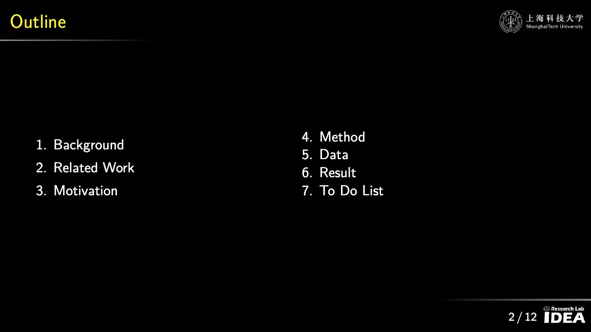

# Beamber_Template_IDEALAB

A clean, production-ready **LaTeX Beamer** template for research presentations.  
Dark (IDEALAB-style) theme with yellow accents, 16:9 layout, TikZ components, curated slide patterns, and a VS Code/Overleaf-friendly toolchain. **No CJK packages** by default (pdfLaTeX first; XeLaTeX optional).



---

## Features

- **16:9 Beamer** layout (`aspectratio=169`) with a dark/yellow palette
- Ready-made slide patterns: Title, Agenda, Two-column, Figure+Caption, Algorithm, Results, Backup
- **TikZ component kit** (rounded boxes, arrows, grids)
- IEEE-friendly hyperlink + superscript-reference styling
- `latexmk` + Makefile recipes, **VS Code LaTeX-Workshop** setup, Overleaf-ready
- Optional **minted** code blocks (Pygments) with `-shell-escape`
- Minimal **GitHub Actions** workflow for reproducible PDF builds
- **pdfLaTeX by default**; **XeLaTeX optional** for system fonts

---

## Quick Start

### macOS / Linux
```bash
git clone https://github.com/<your-org>/Beamber_Template_IDEALAB.git
cd Beamber_Template_IDEALAB
make pdf    # or: latexmk -pdf -synctex=1 -interaction=nonstopmode -outdir=output main.tex
open output/main.pdf  # macOS; use xdg-open on Linux
```

### VS Code Configuration
Place this in .vscode/settings.json:
```bash
{
  "latex-workshop.view.pdf.viewer": "tab",
  "latex-workshop.view.pdf.invert": 0,
  "latex-workshop.message.update.show": false,

  "latex-workshop.latex.outDir": "output",
  "latex-workshop.chktex.enabled": true,

  "latex-workshop.latex.recipes": [
    { "name": "pdfLaTeX", "tools": ["pdflatex"] },
    { "name": "pdfLaTeX ➜ BibTeX ➜ pdfLaTeX ×2", "tools": ["pdflatex", "bibtex", "pdflatex", "pdflatex"] },
    { "name": "XeLaTeX (optional)", "tools": ["xelatex"] },
    { "name": "XeLaTeX (minted, optional)", "tools": ["xelatex-shell-escape"] }
  ],
  "latex-workshop.latex.tools": [
    { "name": "pdflatex", "command": "latexmk",
      "args": ["-pdf","-synctex=1","-interaction=nonstopmode","-outdir=output","%DOC%"] },
    { "name": "xelatex", "command": "latexmk",
      "args": ["-xelatex","-synctex=1","-interaction=nonstopmode","-outdir=output","%DOC%"] },
    { "name": "xelatex-shell-escape", "command": "latexmk",
      "args": ["-xelatex","-shell-escape","-synctex=1","-interaction=nonstopmode","-outdir=output","%DOC%"] },
    { "name": "bibtex", "command": "bibtex", "args": ["%DOCFILE%"] }
  ],

  "files.encoding": "utf8",
  "editor.wordWrap": "on",
  "editor.rulers": [100],
  "editor.formatOnSave": false
}
```


